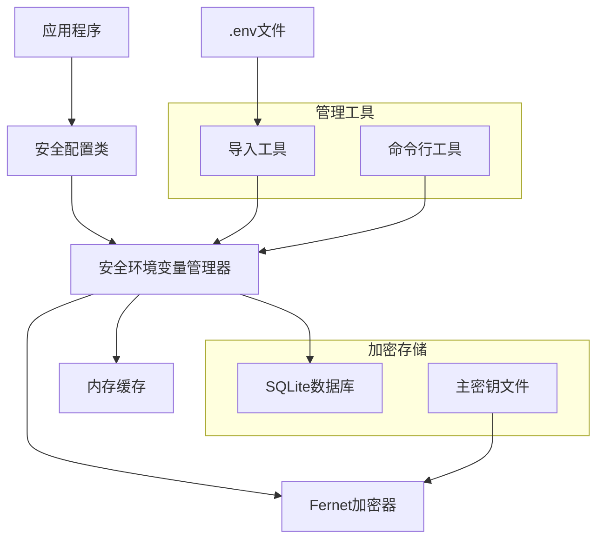

# 🔐 安全环境变量管理系统

## 📋 解决方案概述

本系统为您提供了一个完整的安全环境变量管理解决方案，解决了传统`.env`文件存在的安全隐患：

### 🎯 解决的问题
- ❌ `.env`文件包含明文敏感信息
- ❌ 容易误提交到版本控制系统
- ❌ 团队协作时敏感信息泄露风险
- ❌ 生产环境配置管理复杂

### ✅ 提供的解决方案
- 🔒 **加密存储**: 使用AES加密算法保护敏感信息
- 🗄️ **SQLite数据库**: 本地轻量级数据库存储
- 🔑 **密钥管理**: 自动生成和管理主密钥
- 📁 **分类管理**: 按功能自动分类环境变量
- 🛠️ **命令行工具**: 便捷的管理界面
- 🔄 **无缝迁移**: 从传统.env文件平滑迁移

## 🏗️ 系统架构



## 🚀 快速开始

### 1. 安装和初始化

```bash
# 1. 运行初始化脚本
python setup_secure_env.py

# 2. 验证安装
python backend/app/env_manager_cli.py stats
```

### 2. 基本使用

```python
# 在代码中使用安全配置
from backend.app.secure_config import get_secure_settings

settings = get_secure_settings()
database_url = settings.database_url
jwt_secret = settings.jwt_secret_key
```

### 3. 命令行管理

```bash
# 设置新的环境变量
python backend/app/env_manager_cli.py set API_KEY "your-secret-key" --category api

# 查看所有配置
python backend/app/env_manager_cli.py list

# 备份数据库
python backend/app/env_manager_cli.py backup
```

## 📁 文件说明

| 文件 | 说明 | 是否提交到Git |
|------|------|---------------|
| `secure_env.py` | 核心管理器 | ✅ 是 |
| `secure_config.py` | 安全配置类 | ✅ 是 |
| `env_manager_cli.py` | 命令行工具 | ✅ 是 |
| `setup_secure_env.py` | 初始化脚本 | ✅ 是 |
| `secure_env.db` | 加密数据库 | ❌ 否 |
| `.master_key` | 主密钥文件 | ❌ 否 |
| `.env` | 原始配置文件 | ❌ 否 |
| `.env.template` | 配置模板 | ✅ 是 |

## 🔒 安全特性

### 加密算法
- **Fernet**: AES 128 CBC + HMAC SHA256
- **PBKDF2**: 100,000次迭代的密钥派生
- **随机盐**: 增强密钥安全性

### 密钥管理
- 自动生成32字节随机主密钥
- 支持环境变量覆盖
- 文件权限自动设置为600

### 访问控制
- 内存缓存减少数据库访问
- 分类管理支持精细控制
- 开发环境专用管理端点

## 📊 使用统计

运行演示脚本查看系统功能：

```bash
python demo_secure_env.py
```

## 🛠️ 高级功能

### 1. 批量导入
```bash
# 从现有.env文件导入
python backend/app/env_manager_cli.py import .env
```

### 2. 分类管理
```bash
# 按分类查看
python backend/app/env_manager_cli.py list --category database

# 按分类加载
python backend/app/env_manager_cli.py load --category security
```

### 3. 备份恢复
```bash
# 创建备份
python backend/app/env_manager_cli.py backup --backup-path backup.db

# 恢复备份（手动复制文件）
cp backup.db secure_env.db
```

## 🔧 配置示例

### 数据库配置
```python
# 传统方式
DATABASE_URL = os.getenv("DATABASE_URL")

# 安全方式
settings = get_secure_settings()
database_url = settings.database_url
```

### JWT配置
```python
# 传统方式
JWT_SECRET = os.getenv("JWT_SECRET_KEY")

# 安全方式
settings = get_secure_settings()
jwt_secret = settings.jwt_secret_key
```

## 🚨 注意事项

### 生产环境部署
1. 设置环境变量 `SECURE_ENV_MASTER_KEY`
2. 部署加密数据库文件
3. 确保文件权限正确设置
4. 定期备份数据库

### 团队协作
1. 提交 `.env.template` 到版本控制
2. 团队成员根据模板创建本地配置
3. 使用初始化脚本设置个人环境
4. 不要共享 `.master_key` 文件

### 故障恢复
- 密钥丢失：无法恢复，需重新设置
- 数据库损坏：从备份恢复
- 配置错误：使用命令行工具修正

## 📚 相关文档

- [详细使用指南](SECURE_ENV_GUIDE.md)
- [系统设计文档](auth_system_design.md)
- [认证系统指南](AUTHENTICATION_SYSTEM_GUIDE.md)

## 🎯 最佳实践

1. **定期备份**: 设置自动备份计划
2. **密钥轮换**: 定期更换主密钥
3. **权限控制**: 严格控制文件访问权限
4. **监控审计**: 记录配置变更日志
5. **环境隔离**: 不同环境使用不同密钥

## 💡 使用建议

### 开发阶段
```bash
# 快速开始
python setup_secure_env.py
python demo_secure_env.py
```

### 测试阶段
```bash
# 创建测试配置
python backend/app/env_manager_cli.py set TEST_DATABASE_URL "test-db-url" --category database
```

### 生产阶段
```bash
# 设置生产密钥
export SECURE_ENV_MASTER_KEY="production-master-key"
# 部署应用
python backend/app/main_secure.py
```

---

🔐 **安全提醒**: 请妥善保管主密钥文件，定期备份加密数据库，确保生产环境的配置安全。