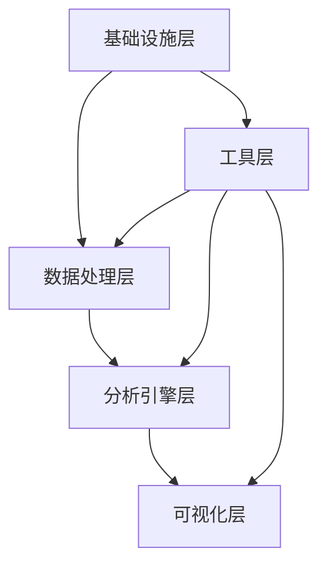

# 🧩 功能模块分解

## 模块架构概览

```
Python数据科学平台
├── 🏗️ 基础设施层 (Infrastructure Layer)
│   ├── 环境管理模块
│   ├── 配置管理模块
│   ├── 日志系统模块
│   └── 错误处理模块
├── 📊 数据处理层 (Data Processing Layer)
│   ├── 数据导入模块
│   ├── 数据清洗模块
│   ├── 数据转换模块
│   └── 数据验证模块
├── 🧠 分析引擎层 (Analytics Engine Layer)
│   ├── 统计分析模块
│   ├── 机器学习模块
│   ├── 时间序列模块
│   └── 高级分析模块
├── 📈 可视化层 (Visualization Layer)
│   ├── 图表生成模块
│   ├── 交互式可视化模块
│   ├── Web界面模块
│   └── 仪表板模块
└── 🔧 工具层 (Utilities Layer)
    ├── 测试工具模块
    ├── 性能监控模块
    ├── 文档生成模块
    └── 部署工具模块
```

## 📋 详细模块分解

### 1. 🏗️ 基础设施层

#### 1.1 环境管理模块 (Environment Management)
**优先级**: 🔴 高  
**预计工期**: 1周  
**负责人**: 待分配

**功能描述**: 管理Python开发环境和依赖包

**子任务**:
- [ ] **ENV-001**: 配置UV包管理器
  - 估时: 1天
  - 依赖: 无
  - 验收标准: UV正常安装和管理包
  
- [ ] **ENV-002**: 配置Conda环境
  - 估时: 1天
  - 依赖: ENV-001
  - 验收标准: Conda环境可正常创建和激活
  
- [ ] **ENV-003**: 创建Docker容器支持
  - 估时: 2天
  - 依赖: ENV-001, ENV-002
  - 验收标准: Docker镜像可正常构建和运行
  
- [ ] **ENV-004**: 环境一致性检查
  - 估时: 1天
  - 依赖: ENV-003
  - 验收标准: 所有环境依赖版本一致

#### 1.2 配置管理模块 (Configuration Management)
**优先级**: 🟡 中  
**预计工期**: 0.5周  
**负责人**: 待分配

**子任务**:
- [ ] **CFG-001**: 创建配置文件结构
- [ ] **CFG-002**: 实现配置加载机制
- [ ] **CFG-003**: 环境变量管理
- [ ] **CFG-004**: 配置验证功能

#### 1.3 日志系统模块 (Logging System)
**优先级**: 🟡 中  
**预计工期**: 0.5周  
**负责人**: 待分配

**子任务**:
- [ ] **LOG-001**: 设计日志格式标准
- [ ] **LOG-002**: 实现多级别日志
- [ ] **LOG-003**: 日志轮转机制
- [ ] **LOG-004**: 日志分析工具

#### 1.4 错误处理模块 (Error Handling)
**优先级**: 🟡 中  
**预计工期**: 0.5周  
**负责人**: 待分配

**子任务**:
- [ ] **ERR-001**: 自定义异常类设计
- [ ] **ERR-002**: 全局异常处理器
- [ ] **ERR-003**: 错误恢复机制
- [ ] **ERR-004**: 错误报告系统

### 2. 📊 数据处理层

#### 2.1 数据导入模块 (Data Import)
**优先级**: 🔴 高  
**预计工期**: 1周  
**负责人**: 待分配

**子任务**:
- [ ] **IMP-001**: CSV文件导入
  - 估时: 1天
  - 验收标准: 支持各种CSV格式和编码
  
- [ ] **IMP-002**: Excel文件导入
  - 估时: 1天
  - 验收标准: 支持.xlsx和.xls格式
  
- [ ] **IMP-003**: JSON数据导入
  - 估时: 0.5天
  - 验收标准: 支持嵌套JSON结构
  
- [ ] **IMP-004**: 数据库连接导入
  - 估时: 2天
  - 验收标准: 支持MySQL, PostgreSQL, SQLite
  
- [ ] **IMP-005**: API数据导入
  - 估时: 1.5天
  - 验收标准: 支持REST API和认证

#### 2.2 数据清洗模块 (Data Cleaning)
**优先级**: 🔴 高  
**预计工期**: 1.5周  
**负责人**: 待分配

**子任务**:
- [ ] **CLN-001**: 缺失值处理
- [ ] **CLN-002**: 重复数据检测和处理
- [ ] **CLN-003**: 异常值检测和处理
- [ ] **CLN-004**: 数据类型转换
- [ ] **CLN-005**: 文本数据清洗
- [ ] **CLN-006**: 数据标准化

#### 2.3 数据转换模块 (Data Transformation)
**优先级**: 🟡 中  
**预计工期**: 1周  
**负责人**: 待分配

**子任务**:
- [ ] **TRF-001**: 数据聚合功能
- [ ] **TRF-002**: 数据透视表
- [ ] **TRF-003**: 特征工程
- [ ] **TRF-004**: 数据合并和连接
- [ ] **TRF-005**: 时间序列重采样

#### 2.4 数据验证模块 (Data Validation)
**优先级**: 🟡 中  
**预计工期**: 0.5周  
**负责人**: 待分配

**子任务**:
- [ ] **VAL-001**: 数据质量检查
- [ ] **VAL-002**: 数据完整性验证
- [ ] **VAL-003**: 业务规则验证
- [ ] **VAL-004**: 数据血缘追踪

### 3. 🧠 分析引擎层

#### 3.1 统计分析模块 (Statistical Analysis)
**优先级**: 🔴 高  
**预计工期**: 2周  
**负责人**: 待分配

**子任务**:
- [ ] **STA-001**: 描述性统计
  - 估时: 2天
  - 验收标准: 均值、中位数、标准差等基础统计量
  
- [ ] **STA-002**: 假设检验
  - 估时: 3天
  - 验收标准: t检验、卡方检验、方差分析
  
- [ ] **STA-003**: 相关性分析
  - 估时: 2天
  - 验收标准: 皮尔逊、斯皮尔曼相关系数
  
- [ ] **STA-004**: 回归分析
  - 估时: 3天
  - 验收标准: 线性回归、多项式回归、逻辑回归
  
- [ ] **STA-005**: 方差分析
  - 估时: 2天
  - 验收标准: 单因素、多因素方差分析

#### 3.2 机器学习模块 (Machine Learning)
**优先级**: 🔴 高  
**预计工期**: 2.5周  
**负责人**: 待分配

**子任务**:
- [ ] **ML-001**: 监督学习算法
  - 分类算法: SVM, 随机森林, 梯度提升
  - 回归算法: 线性回归, 决策树回归
  
- [ ] **ML-002**: 无监督学习算法
  - 聚类: K-means, 层次聚类, DBSCAN
  - 降维: PCA, t-SNE, UMAP
  
- [ ] **ML-003**: 模型评估和选择
  - 交叉验证, 网格搜索, 模型比较
  
- [ ] **ML-004**: 特征选择和工程
  - 特征重要性, 特征选择算法
  
- [ ] **ML-005**: 模型解释性
  - SHAP值, 特征重要性可视化

#### 3.3 时间序列模块 (Time Series Analysis)
**优先级**: 🟡 中  
**预计工期**: 1.5周  
**负责人**: 待分配

**子任务**:
- [ ] **TS-001**: 时间序列分解
- [ ] **TS-002**: 趋势和季节性分析
- [ ] **TS-003**: ARIMA模型
- [ ] **TS-004**: 时间序列预测
- [ ] **TS-005**: 异常检测

#### 3.4 高级分析模块 (Advanced Analytics)
**优先级**: 🟢 低  
**预计工期**: 1周  
**负责人**: 待分配

**子任务**:
- [ ] **ADV-001**: 网络分析
- [ ] **ADV-002**: 文本分析
- [ ] **ADV-003**: 图像分析基础
- [ ] **ADV-004**: 深度学习集成

### 4. 📈 可视化层

#### 4.1 图表生成模块 (Chart Generation)
**优先级**: 🔴 高  
**预计工期**: 1.5周  
**负责人**: 待分配

**子任务**:
- [ ] **CHT-001**: 基础图表类型
  - 线图、柱状图、散点图、饼图
  
- [ ] **CHT-002**: 统计图表
  - 直方图、箱线图、小提琴图
  
- [ ] **CHT-003**: 高级图表
  - 热力图、树状图、桑基图
  
- [ ] **CHT-004**: 3D可视化
  - 3D散点图、3D曲面图
  
- [ ] **CHT-005**: 图表样式定制
  - 主题、颜色、字体配置

#### 4.2 交互式可视化模块 (Interactive Visualization)
**优先级**: 🟡 中  
**预计工期**: 2周  
**负责人**: 待分配

**子任务**:
- [ ] **INT-001**: 图表交互功能
- [ ] **INT-002**: 数据筛选器
- [ ] **INT-003**: 动态更新
- [ ] **INT-004**: 图表联动
- [ ] **INT-005**: 导出功能

#### 4.3 Web界面模块 (Web Interface)
**优先级**: 🔴 高  
**预计工期**: 2.5周  
**负责人**: 待分配

**子任务**:
- [ ] **WEB-001**: 前端框架搭建
- [ ] **WEB-002**: 用户界面设计
- [ ] **WEB-003**: 数据上传界面
- [ ] **WEB-004**: 分析结果展示
- [ ] **WEB-005**: 用户会话管理

#### 4.4 仪表板模块 (Dashboard)
**优先级**: 🟡 中  
**预计工期**: 1.5周  
**负责人**: 待分配

**子任务**:
- [ ] **DSH-001**: 仪表板布局引擎
- [ ] **DSH-002**: 组件拖拽功能
- [ ] **DSH-003**: 实时数据更新
- [ ] **DSH-004**: 仪表板模板
- [ ] **DSH-005**: 分享和导出

### 5. 🔧 工具层

#### 5.1 测试工具模块 (Testing Tools)
**优先级**: 🔴 高  
**预计工期**: 1周  
**负责人**: 待分配

**子任务**:
- [ ] **TST-001**: 单元测试框架
- [ ] **TST-002**: 集成测试
- [ ] **TST-003**: 性能测试
- [ ] **TST-004**: 测试覆盖率报告
- [ ] **TST-005**: 自动化测试流水线

#### 5.2 性能监控模块 (Performance Monitoring)
**优先级**: 🟡 中  
**预计工期**: 0.5周  
**负责人**: 待分配

**子任务**:
- [ ] **MON-001**: 性能指标收集
- [ ] **MON-002**: 内存使用监控
- [ ] **MON-003**: 执行时间分析
- [ ] **MON-004**: 性能报告生成

#### 5.3 文档生成模块 (Documentation)
**优先级**: 🟡 中  
**预计工期**: 1周  
**负责人**: 待分配

**子任务**:
- [ ] **DOC-001**: API文档自动生成
- [ ] **DOC-002**: 用户手册
- [ ] **DOC-003**: 开发者指南
- [ ] **DOC-004**: 示例和教程

#### 5.4 部署工具模块 (Deployment Tools)
**优先级**: 🟡 中  
**预计工期**: 1周  
**负责人**: 待分配

**子任务**:
- [ ] **DEP-001**: Docker容器化
- [ ] **DEP-002**: CI/CD流水线
- [ ] **DEP-003**: 环境配置自动化
- [ ] **DEP-004**: 监控和日志集成

## 📊 模块依赖关系



## 🎯 开发优先级

### 第一优先级 (必须完成)
- 环境管理模块
- 数据导入模块
- 数据清洗模块
- 统计分析模块
- 机器学习模块
- 图表生成模块
- Web界面模块
- 测试工具模块

### 第二优先级 (重要功能)
- 配置管理模块
- 日志系统模块
- 数据转换模块
- 交互式可视化模块
- 仪表板模块
- 时间序列模块

### 第三优先级 (增强功能)
- 错误处理模块
- 数据验证模块
- 高级分析模块
- 性能监控模块
- 文档生成模块
- 部署工具模块

---
*模块分解版本: v1.0*  
*最后更新: 2024年12月*